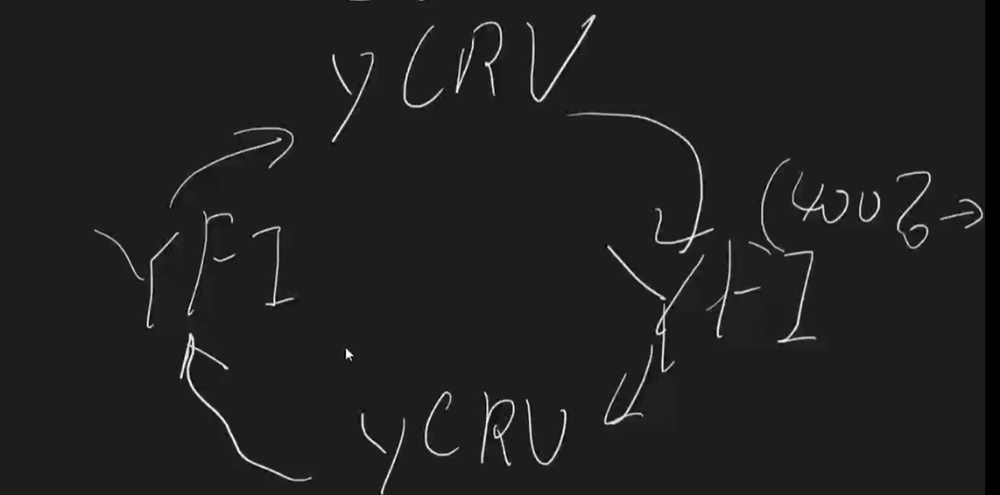

> [视频地址](https://www.bilibili.com/video/BV1ch411Z784)

# 什么是YFI?

## 先从2个项目说起

### yearn

> 做借贷的项目(compound)原理: USDC -> compound -> CUSDC
>
> 用户把资产USDC存入compound, 获得债券CUSDC, 这个债券带有一定收益率;

​								  																  /-->Aaue

用户存入USDC --> yearn -- (选择利率高的项目存入稳定币)  --> compound

​																									\\-->dYdX

### curve

* 流动性挖矿原理:

  用户的usd --> 兑换池 --> [Dai, USDT, USDC] (稳定代币) -->yearn合约 --> 择优DeFi项目 --> (如yUSDC)债券收益代币(收益为利息)--> iearn合约 -> 资产池 --> yCRV(在资产池中作为流动性资产, 获取交易手续费)

  

  > tips:
  >
  > 1. 相同兑换池内的稳定代币能够相互兑换, 不同兑换池之间不能兑换;
  > 2. 资产池: 用户把自己的稳定代币, 作为流动性资产, 存入到兑换池中;

### YFI代币怎么获得? 怎么使用?

把 yCRV --> YFI智能合约(作为staking) --> YFI & CRV(治理)

> yearn把收益, 通过智能合约的方式, 放入vault仓库中, 通过YFI作为凭证来提取vault中的收益(通常YFI与vault中的稳定代币数量一致), 一旦收益被提取, YFI即被销毁;

YFI还能够对yearn中的各个DeFi项目的费率进行修改, 需要投票修改;

YFI内循环挖矿: 

>  tips:
>
> 1. 目前资产池个数: 3
>
> 2. 资产池中YFI上限: 10000
> 3. 流通中的YFI个数: 30000
> 4. 初始供应量: 0
> 5. 产生YFI方式: 流动性挖矿;

# 优点

1. 分配公平
2. 社区可控的筹码

# 风险

1. 通过很多智能合约的转换, 合约没有经过技术审计, 存在安全风险
2. 发行量: 不确定;
3. DeFi项目过热并退却之后: 代币数量会下降, YFI与代币的兑换率受到影响; 